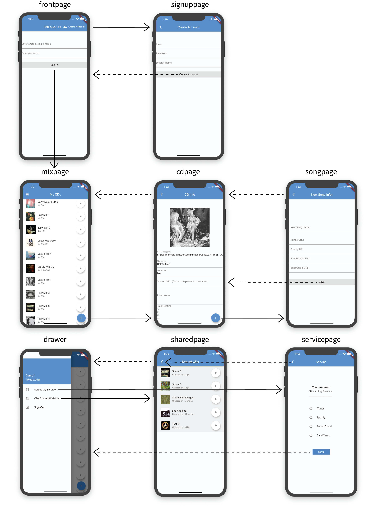

# Mix CD (2019)

A music app designed to simulate the nostalgic experience of creating mix CDs that can be shared with friends. Recipients may specify which streaming services they use so that shared mixes may be played by anyone who has access to \*any* streaming service (given track availability.) Only services which continue playing when phone is locked are available (no YouTube, etc.), the idea being that the mixes are listenable in a car while driving or on headphones with a locked phone in a pocket, as a tape or CD would be.

*Note: This was an academic project that I started during my junior year of undergrad. It is incomplete at this time.

<!--## Table of Contents
- [Dev Setup](#dev-setup)
- [Prerequisites](#prerequisites)
- [Installing](#installing)
- [Built With](#built-with)

## Dev Setup

These instructions will get you a copy of the project up and running on your local machine for development and testing purposes. See deployment for notes on how to deploy the project on a live system.

## Prerequisites

What things you need to install the software and how to install them

```
Give examples
```

## Installing

A step by step series of examples that tell you how to get a development env running

Say what the step will be

```
Give the example
```

And repeat

```
until finished
```

End with an example of getting some data out of the system or using it for a little demo
-->
<br/>

## Built With

* [Dart](https://dart.dev/guides/) - Language
* [Google Firebase](https://firebase.google.com/docs/) - Mobile platform
* [Flutter](https://flutter.dev/docs/) - UI development kit
* iOS Emulator
<br/>

## Flowchart




